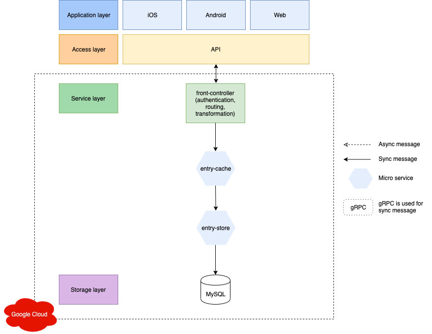

## go-microservices
https://medium.com/@trongdth/go-microservice-api-gateways-pattern-185c2055ea00

### Requirements:

- Setup a database in mySQL.
- Install redis: https://redis.io/topics/quickstart
- Install gRPC: https://grpc.io/blog/installation/
- Install dep: https://golang.github.io/dep/docs/installation.html

### System architecture:

### How to run:

- front-controller:
    + git clone https://github.com/trongdth/go_microservices.git
    + cd front-controller
    + mv config/.env_sample.sh config/.env.sh
    + source config/.env.sh
    + dep ensure
    + go run server.go

- entry-cache:
    + git clone https://github.com/trongdth/go_microservices.git
    + redis-server
    + cd entry-cache
    + mv config/.env_sample.sh config/.env.sh
    + source config/.env.sh
    + dep ensure
    + go run server.go

- entry-store:
    + git clone https://github.com/trongdth/go_microservices.git
    + cd entry-store
    + mv config/.env_sample.sh config/.env.sh
    + source config/.env.sh
    + dep ensure
    + go run server.go

### Created & Maintained By

[Trong Dinh](https://github.com/trongdth) ([@trongdth](https://www.twitter.com/trongdth))

> If you found this project helpful or you learned something from the source code and want to thank me, consider buying me a cup of :coffee:
>
> * [Ethereum address: 0x9a1592C20A15f99AbB6b69E199f38D50Fa8372Ac]
> * [EOS account: zcryptoman1z]
